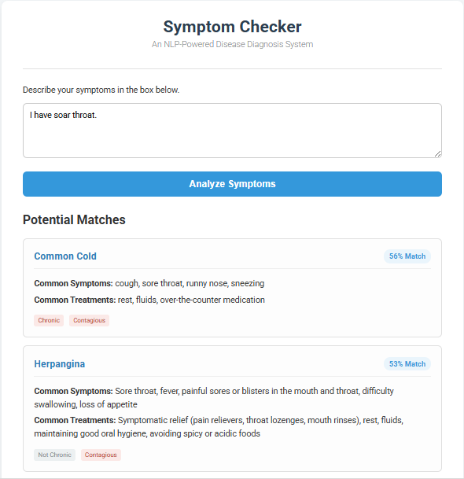

# NLP-Powered Disease Diagnosis System


This project is an end-to-end web application that leverages Natural Language Processing to assist users in identifying potential diseases based on their described symptoms. It uses a state-of-the-art Sentence-Transformer model to understand the semantic meaning of symptoms, providing more accurate and context-aware results than simple keyword matching.

The entire application is built with a production-ready mindset, separating the data science development (in a Jupyter Notebook) from the deployed Flask application, ensuring efficiency and maintainability.

---

## ► Live Demo

**[► View Live Demo](https://disease-diagnosis-system.onrender.com)**  
*(Note: As this is hosted on a free tier, the first load may take up to 50 seconds while the service spins up from sleep.)*

---

## 📸 Application Preview



---

## ✨ Key Features

*   **Semantic Symptom Search:** Utilizes a memory-efficient Sentence-Transformer model (`paraphrase-MiniLM-L3-v2`) to understand the *meaning* of user input, not just keywords.
*   **Ranked Results with Confidence Score:** Returns the top 5 most likely diseases, ranked by their cosine similarity score, giving users a sense of the model's confidence.
*   **Clean, Responsive UI:** A modern and intuitive user interface built with vanilla HTML, CSS, and JavaScript that provides a seamless user experience.
*   **Production-Ready Backend:** A robust Flask API, containerized with Docker, that loads the ML model artifacts once at startup for maximum performance.
*   **Cloud-Deployed:** Fully deployed on Render, demonstrating a complete end-to-end MLOps workflow from development to production.

---

## 🛠️ Tech Stack

### **Data Science & Machine Learning**
*   **Python:** Core programming language.
*   **Pandas:** For data manipulation and analysis.
*   **Sentence-Transformers:** For generating high-quality semantic embeddings.
*   **Scikit-learn:** For calculating cosine similarity.
*   **Jupyter Notebook:** For interactive development, EDA, and model processing.

### **Backend & Deployment**
*   **Flask:** A lightweight web framework for building the API.
*   **Gunicorn:** A production-grade WSGI server.
*   **Docker:** For containerizing the application to ensure a consistent and reproducible environment.
*   **Render:** A cloud platform for deploying the containerized application.

### **Frontend**
*   **HTML5, CSS3, JavaScript:** Standard web technologies for the user interface.

---

## 🏛️ Project Architecture

This project follows a professional, industry-standard architecture that separates concerns for maintainability and scalability.

```
disease_diagnosis_app/
│
├── notebook/
│   └── data_exploration_and_modeling.ipynb
│
├── model_artifacts/
│   ├── processed_diseases.parquet
│   └── symptom_embeddings.npy
│
├── static/
│   └── styles.css
│
├── templates/
│   └── index.html
│
├── .gitignore
├── app.py
├── Dockerfile
└── requirements.txt
```

### **The "Two-Phase" Philosophy**
1.  **Phase 1 (Development - The Notebook):** The `notebook/data_exploration_and_modeling.ipynb` notebook is used for all heavy-lifting. It handles data loading, cleaning, EDA, and the computationally expensive process of generating embeddings. Its final output is the lightweight, ready-to-use **model artifacts**.
2.  **Phase 2 (Production - The Flask App):** The `app.py` is a lightweight server. It does **not** re-run any data science processes. It simply loads the pre-computed artifacts from `model_artifacts/` once at startup and uses them to serve predictions quickly. This separation is a core MLOps principle.

---

## 🧠 From Development to Deployment: A Note on Model Selection

A key challenge in this project was bridging the gap between an ideal development environment and a real-world production deployment with resource constraints. This process demonstrates a crucial aspect of professional machine learning engineering.

*   **Initial Development:** In the Jupyter Notebook, the `all-MiniLM-L6-v2` model was initially used. It provided the highest semantic search accuracy during local testing.

*   **Deployment Challenge:** The initial deployment attempts on Render's free tier failed due to "Out of Memory" errors. The `all-MiniLM-L6-v2` model, while accurate, had a memory footprint that exceeded the 512MB RAM limit of the free instance.

*   **The Engineering Trade-off:** To ensure a successful and stable deployment, a pragmatic decision was made to switch to a more lightweight model: `paraphrase-MiniLM-L3-v2`. While this model has a slightly lower theoretical accuracy, its significantly smaller memory footprint allows the application to run smoothly and reliably on a cost-effective hosting plan.

This process highlights a critical real-world MLOps skill: **optimizing and selecting models not just for accuracy, but for performance and feasibility within a given production environment.**

---

## 🚀 Running the Project Locally

To run this application on your local machine, follow these steps:

1.  **Clone the Repository**
    ```bash
    git clone https://github.com/MdEhsanulHaqueKanan/disease-diagnosis-system.git
    cd disease-diagnosis-system
    ```

2.  **Create and Activate a Virtual Environment**
    ```bash
    # Create the virtual environment
    python -m venv venv

    # Activate it (on Windows)
    venv\Scripts\activate

    # Activate it (on macOS/Linux)
    source venv/bin/activate
    ```

3.  **Install Dependencies**
    ```bash
    (venv) pip install -r requirements.txt
    ```

4.  **Run the Flask Application**
    ```bash
    (venv) python app.py
    ```

5.  **Access the Application**
    Open your web browser and navigate to `http://127.0.0.1:5000`.

